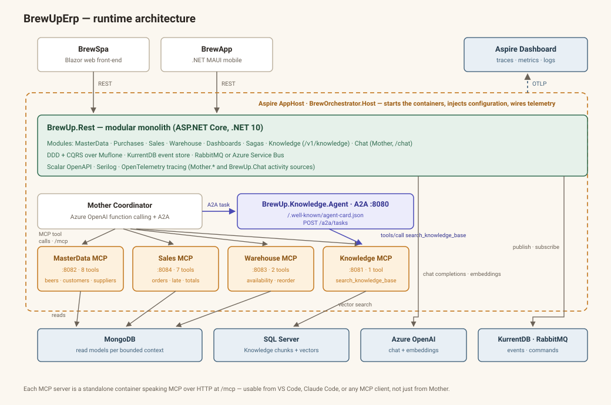
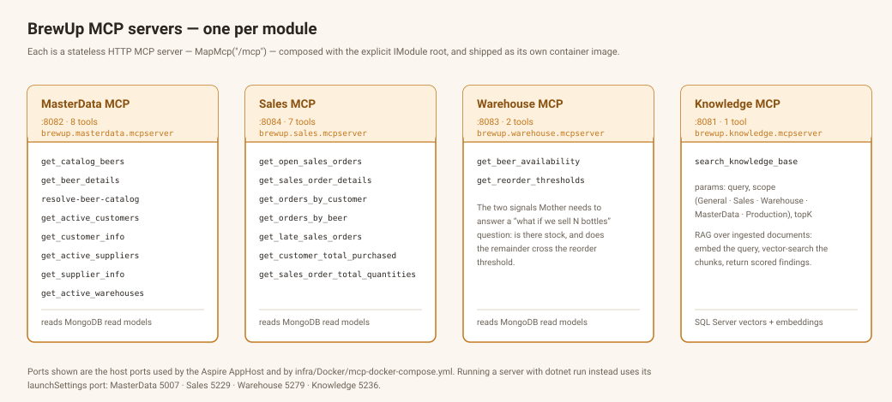
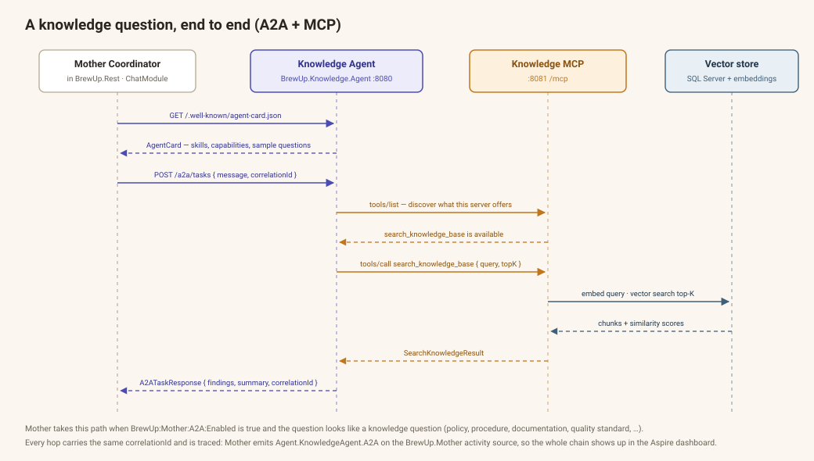
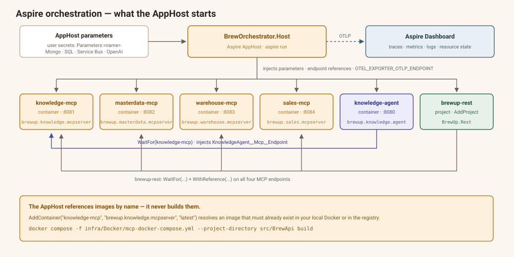

# BrewUpErp

BrewUpErp is an end‑to‑end sample ERP for a brewery, built to demonstrate:

- Domain‑Driven Design (DDD) and a modular / bounded‑context architecture
- CQRS and event sourcing with [Muflone](https://github.com/BrewUp/Muflone)
- Functional‑style domain modelling and clean, testable application layers
- **An agentic AI layer**: one MCP server per module, an A2A agent, and a coordinator that orchestrates them
- **.NET Aspire** for local orchestration and observability of every service

The solution is intentionally realistic but still small enough to study.
It consists of:

- **BrewApi** – backend HTTP API, domain, MCP servers and the Knowledge agent (ASP.NET Core, .NET 10)
- **BrewSpa** – Blazor web front‑end
- **BrewApp** – .NET MAUI mobile application

> Note: this repository is a work in progress. Expect breaking changes
> and incomplete features, especially in less‑used flows.

---

## Architecture at a glance



The backend is a **modular monolith** (`BrewUp.Rest`) surrounded by **independently deployable MCP
servers** — one per module — plus a **standalone A2A agent** for the Knowledge module. The MCP servers
never talk to the monolith: each one reads its own module's read model directly, so the AI surface of
a module ships and scales on its own.

Two consumers use that surface:

- the **Mother coordinator** inside `BrewUp.Rest`, which drives Azure OpenAI function calling over the
  pooled tool catalog of all four MCP servers, and delegates knowledge questions to the Knowledge agent
  over A2A;
- **any external MCP client** (VS Code, Claude Code, …), since every server speaks plain MCP over HTTP
  at `/mcp`.

The whole set is started by the **Aspire AppHost**, which injects configuration and points every
service at the Aspire dashboard over OTLP.

---

## Solution Structure

```
src/
├── BrewApi/          # Backend API, domain, MCP servers, Knowledge agent, Aspire AppHost
├── BrewSpa/          # Blazor web front-end
└── BrewApp/          # .NET MAUI mobile app
BrewDocs/             # Bruno API contracts & example payloads
docker/               # Backing services (KurrentDB, MongoDB, RabbitMQ)
infra/
├── Bicep/            # Azure Container Apps deployment
└── Docker/           # MCP + agent compose files, .env template
docs/images/          # Architecture diagrams
```

### BrewApi

The backend solution is `src/BrewApi/BrewUp.slnx`.

**Orchestration & cross‑cutting projects**

| Project | Purpose |
|---|---|
| `BrewOrchestrator.Host` | .NET Aspire AppHost — starts the MCP containers, the Knowledge agent and the REST API |
| `BrewOrchestrator.ServiceDefaults` | Aspire service defaults: OpenTelemetry, health checks, service discovery, HTTP resilience |
| `BrewUp.Rest` | ASP.NET Core Web API host — composition root with explicit module registration |
| `BrewUp.Shared` | Shared abstractions: value objects, domain IDs, messages, read‑model contracts, validators, **A2A agent contracts** (`AgentCard`, `A2ATaskRequest/Response`, `IAgent`) |
| `BrewUp.Infrastructure` | Cross‑cutting infrastructure: MongoDB helper, Muflone wiring (KurrentDB, RabbitMQ, Azure Service Bus) |

**Bounded contexts** — each normally contains `Domain`, `Facade`, `Infrastructure`, `ReadModel`,
`SharedKernel` and `Tests`:

| Context | Description | MCP server |
|---|---|---|
| `MasterData/` | Beer catalog, customers, suppliers, warehouses (also has `.Entities`) | ✅ `BrewUp.MasterData.McpServer` |
| `Sales/` | Sales orders and related workflows | ✅ `BrewUp.Sales.McpServer` |
| `Warehouse/` | Warehouse and stock management (also has `.Entities`) | ✅ `BrewUp.Warehouse.McpServer` |
| `Knowledge/` | Document ingestion, chunking, embeddings and RAG search (has `.Core` in place of `.Domain`) | ✅ `BrewUp.Knowledge.McpServer` + `BrewUp.Knowledge.Agent` |
| `Purchases/` | Purchase orders | — |
| `Dashboards/` | Cross‑context dashboard aggregations (also has `.Entities`) | — |
| `Sagas/` | Long‑running process managers / sagas | — |
| `Chat/` | `BrewUp.Mother.Facade` + `BrewUp.Mother.SharedKernel` — the Mother coordinator, chat service and MCP client pool | — |

**Module composition in `BrewUp.Rest`**

`Program.cs` uses an explicit composition‑root pattern — each feature registers itself as an `IModule`:

```
SharedModule · CorsModule · LoggingModule · TelemetryModule · InfrastructureModule · OpenApiModule
MasterDataModule · PurchasesModule · SalesModule · WarehouseModule
DashboardsModule · SagasModule · ChatModule · KnowledgeModule
```

The same pattern is reused, at a smaller scale, inside every MCP server and inside the Knowledge agent.

### BrewSpa

The Blazor front‑end solution (`src/BrewSpa/BrewSpa.slnx`) mirrors the API's bounded‑context decomposition:

| Project | Purpose |
|---|---|
| `BrewSpa/BrewSpa` | Main Blazor app – shell, layouts, pages, `wwwroot` |
| `BrewSpa.Shared` | Shared client models, helpers, tests |
| `BrewSpa.Shared.Components` | Reusable Razor components, custom types, JS interop, messages |
| `Chat/` | `BrewSpa.Chat.Application`, `BrewSpa.Chat.Facade` — chat UI against the Mother endpoint |
| `Dashboards/` | `BrewSpa.Dashboards.ApplicationServices`, `.Facade`, `.Tests` |
| `MasterData/` | `BrewSpa.MasterData.Application`, `.Facade` |
| `Sales/` | `BrewSpa.Sales.Application`, `.Facade` |

### BrewApp

The .NET MAUI mobile solution lives under `src/BrewApp/mobile/`:

| Folder | Purpose |
|---|---|
| `mobile/src/` | `BrewApp.Mobile` – `AppShell`, features, components, services, models, platform targets |
| `mobile/tests/` | Mobile unit / integration tests |
| `specs/` | Specification & acceptance artifacts (`.specify`) |

### Bounded Context Layer Layout

| Layer | Responsibility |
|---|---|
| `*.Domain` | Aggregates, value objects, domain events, domain services |
| `*.SharedKernel` | Types shared only within the bounded context |
| `*.Infrastructure` | Persistence and integration (MongoDB, event store, messaging, embeddings) |
| `*.ReadModel` | Denormalized read models, queries and projections |
| `*.Facade` | Application services / use‑case orchestration, HTTP endpoints, in‑process agents |
| `*.McpServer` | Standalone MCP server exposing the module's read side as AI tools |

---

## The AI layer

### MCP servers — one per module



Every MCP server is a small ASP.NET Core app that:

- registers a **stateless** HTTP MCP transport and maps it at `/mcp` (`MapMcp("/mcp")`);
- exposes one `[McpServerToolType]` class whose `[McpServerTool]` methods delegate to a thin façade over
  the module's read model;
- calls `AddServiceDefaults()` so it takes part in Aspire telemetry, health checks and resilience;
- exposes `/health` (and `/alive` in Development);
- ships as its own container image.

**MasterData MCP** — `brewup.masterdata.mcpserver`

| Tool | Description |
|---|---|
| `get_catalog_beers` | The current beer catalog |
| `get_beer_details` | Beer details by (partial) beer id |
| `resolve-beer-catalog` | Resolve a beer by (partial) name — used by Mother to turn free text into ids |
| `get_active_customers` | Active customers |
| `get_customer_info` | Customer details by (partial) id |
| `get_active_suppliers` | Active suppliers |
| `get_supplier_info` | Supplier details by (partial) id |
| `get_active_warehouses` | Active warehouses |

**Sales MCP** — `brewup.sales.mcpserver`

| Tool | Description |
|---|---|
| `get_open_sales_orders` | Currently open sales orders |
| `get_sales_order_details` | Order details by (partial) order id |
| `get_orders_by_customer` | Orders for a customer name |
| `get_orders_by_beer` | Orders for a beer name |
| `get_late_sales_orders` | Late orders at a given business date (`yyyy-MM-dd`) |
| `get_customer_total_purchased` | Total purchased per customer |
| `get_sales_order_total_quantities` | Total quantities for an order |

**Warehouse MCP** — `brewup.warehouse.mcpserver`

| Tool | Description |
|---|---|
| `get_beer_availability` | Current availability for a beer |
| `get_reorder_thresholds` | Reorder threshold for a beer |

**Knowledge MCP** — `brewup.knowledge.mcpserver`

| Tool | Description |
|---|---|
| `search_knowledge_base` | RAG search over ingested documents. Parameters: `query`, optional `scope` (`General`, `Sales`, `Warehouse`, `MasterData`, `Production`), `topK` (default 5, capped at 20) |

### Knowledge module — ingestion and RAG

The Knowledge context is the read side that the Knowledge MCP server queries. It is written from
`BrewUp.Rest` through `/v1/knowledge`:

| Endpoint | Purpose |
|---|---|
| `POST /v1/knowledge/ingest` | Ingest a document from text |
| `POST /v1/knowledge/ingest-file` | Ingest an uploaded file (plain text, Markdown, PDF via PdfPig) |
| `POST /v1/knowledge/search` | Search (the same retrieval the MCP tool uses) |
| `GET /v1/knowledge/documents` | List documents |
| `GET /v1/knowledge/documents/{id}` | Document metadata |
| `GET /v1/knowledge/documents/{id}/chunks` | Inspect the chunks produced for a document |
| `POST /v1/knowledge/documents/{id}/reindex` | Re‑chunk and re‑embed |
| `DELETE /v1/knowledge/documents/{id}` | Delete a document and its chunks |

Pipeline: extract text → semantic chunking (`SemanticChunkingStrategy`) → embeddings → vector store.

| Concern | Options |
|---|---|
| Vector store (`Knowledge:VectorStore`) | `SqlServer` (default) or `AzureAiSearch`; an in‑memory store is used when no configuration is supplied (tests) |
| Embeddings | Azure OpenAI (`BrewUp:Embeddings`) when endpoint + deployment are set, otherwise a deterministic `FakeEmbeddingGenerator` so the pipeline still runs offline |

### Knowledge Agent — A2A



`BrewUp.Knowledge.Agent` is a **standalone agent** (built on `Microsoft.Agents.AI`) that fronts the
Knowledge MCP server with an **Agent‑to‑Agent** contract instead of an MCP one:

| Endpoint | Purpose |
|---|---|
| `GET /.well-known/agent-card.json` | Standard A2A discovery document |
| `GET /a2a/agent-card` | The same card, on a convenience route |
| `POST /a2a/tasks` | Submit an `A2ATaskRequest` (`taskId`, `message`, `correlationId`) and get an `A2ATaskResponse` back |

Its agent card advertises the `search_knowledge` skill plus capabilities for knowledge retrieval,
documentation lookup, policy lookup and procedure lookup, with sample questions such as *"What is the
reorder policy for IPA?"*.

On each task the executor **discovers** the tools of the Knowledge MCP server, checks that
`search_knowledge_base` is present, calls it, and maps the hits into `KnowledgeFinding` records —
so a missing or unhealthy MCP server degrades into a clear failure summary rather than an exception.
The MCP endpoint it targets comes from `KnowledgeAgent:Mcp:Endpoint` (Aspire and Compose override it
with the in‑network address).

### Mother — the coordinator

`Chat/BrewUp.Mother.Facade` exposes `POST /chat` and picks one of three paths:

1. **Knowledge question** (`policy`, `procedure`, `documentation`, `quality standard`, …) and
   `BrewUp:Mother:A2A:Enabled` is `true` → delegate to the Knowledge agent over A2A.
2. **"What if" / impact question** with parseable quantities (*"what if we sell 500 bottles of IPA?"*) →
   run the in‑process agent chain `MasterDataAgent` → `SalesAgent` → `WarehouseAgent` →
   `KnowledgeAgent`, then compose a stock/reorder recommendation.
3. **Anything else** → Azure OpenAI chat with function calling over the pooled MCP tool catalog.

Supporting details worth knowing:

- `McpToolsProvider` keeps one long‑lived `McpClient` per server, caches the merged tool catalog and
  refreshes it every 5 minutes; a server that is down is logged and skipped instead of failing the request.
- `FoundryGuardedChatClient` applies the `BrewUp:FoundryLimits` budget (concurrency, requests/minute,
  queue length, max output tokens, max function‑calling iterations) so a small Foundry deployment
  cannot be overrun.
- Every AI request creates a semantic **AgentRun** on the existing OpenTelemetry trace. Mother then adds
  workflow and agent spans that explain *why* the underlying HTTP, MCP, model and database calls happened.
- The run has its own `brewup.agent_run.id`, separate from the technical `TraceId` and the user
  `ConversationId`. The same run identifier is reused as the A2A correlation ID instead of creating
  unrelated identifiers at each layer.

---

## Aspire orchestration & observability



`BrewOrchestrator.Host` is the Aspire AppHost. It:

- declares 16 **parameters** (Mongo, SQL Server, Service Bus, RabbitMQ, KurrentDB, Azure OpenAI and
  embeddings), the sensitive ones marked `secret: true` and read from AppHost user secrets under
  `Parameters:<parameter-name>`;
- starts the four MCP servers and the Knowledge agent as **containers**, and `BrewUp.Rest` as a
  **project**;
- injects connection strings into every container, plus `WithOtlpExporter()` so each one exports traces,
  metrics and logs to the Aspire dashboard;
- wires dependencies: the agent gets `WaitFor(knowledge-mcp)` and its `KnowledgeAgent__Mcp__Endpoint`
  resolved by Aspire (never `localhost`), and `brewup-rest` waits for and references all four MCP endpoints.

> **The AppHost references images by name — it does not build them.**
> `AddContainer("knowledge-mcp", "brewup.knowledge.mcpserver", "latest")` resolves an image that must
> already exist locally or in your registry. See [Building the container images](#2-building-the-container-images).

Telemetry, end to end:

| Source | What it emits |
|---|---|
| `BrewOrchestrator.ServiceDefaults` | ASP.NET Core, HttpClient and runtime instrumentation; OTLP export when `OTEL_EXPORTER_OTLP_ENDPOINT` is set |
| `TelemetryModule` (`BrewUp.Rest`) | Registers the `BrewUp.Mother.Coordinator` and `BrewUp.Chat` activity sources, the `BrewUp.Agent` meter and SqlClient instrumentation; console exporter in Development |
| `MotherTelemetry` | `AgentRun`, `invoke_workflow`, `invoke_agent` and `evaluation` spans, plus agent run, duration and handoff metrics |
| `KnowledgeAgentTelemetry` | Internal Knowledge Agent execution and `execute_tool search_knowledge_base` spans, plus tool-call metrics |
| `BrewUp.Chat` | Existing Microsoft.Extensions.AI model and function-calling instrumentation |

The semantic spans complement rather than replace the existing distributed trace. A what-if request is
represented conceptually as:

```text
HTTP POST /chat
└── AgentRun                                      INTERNAL
    route = what-if
    brewup.agent_run.id = <run id>
    gen_ai.conversation.id = <conversation id>
    └── invoke_workflow brewup.what-if            INTERNAL
        ├── invoke_agent MasterDataAgent          INTERNAL
        │   └── existing MCP / HTTP / database spans
        ├── invoke_agent SalesAgent               INTERNAL
        │   └── existing MCP / HTTP / database spans
        ├── invoke_agent WarehouseAgent           INTERNAL
        │   └── existing MCP / HTTP / database spans
        ├── invoke_agent KnowledgeAgent           INTERNAL
        │   └── existing MCP / HTTP / retrieval spans
        └── evaluation                            INTERNAL
```

Mother is intentionally represented as a deterministic workflow:

```text
gen_ai.operation.name = invoke_workflow
gen_ai.workflow.name  = brewup.what-if
```

Real agent calls use `gen_ai.operation.name = invoke_agent`, `gen_ai.agent.name` and a stable
`gen_ai.agent.id`. In-process agent calls are `INTERNAL`; only the remote A2A call made by Mother is a
`CLIENT` operation. On the Knowledge Agent service the server-side semantic execution remains internal,
while the underlying MCP/HTTP transport retains its existing client span:

```text
invoke_agent KnowledgeAgent                       CLIENT
└── HttpClient / ASP.NET A2A transport            CLIENT / SERVER
    └── invoke_agent BrewUp Knowledge Agent       INTERNAL
        └── execute_tool search_knowledge_base    INTERNAL
            gen_ai.tool.type = datastore
            └── MCP / HTTP / vector search        existing transport/data spans
```

### Correlation and outcomes

The three identifiers deliberately remain distinct:

| Identifier | Meaning |
|---|---|
| OpenTelemetry `TraceId` | Technical distributed trace across processes and transports |
| `gen_ai.conversation.id` | User conversation/session, propagated when available |
| `brewup.agent_run.id` | One semantic execution of a user request; also carried through the A2A correlation mechanism |

`brewup.route` has one of three low-cardinality values: `direct-ai`, `what-if` or `knowledge-a2a`.
`brewup.outcome` describes operational execution (`completed`, `partial` or `failed`) and is independent
from deterministic evidence evaluation. Consequently, a valid trace can show:

```text
HTTP success                  = true
brewup.outcome                = completed
brewup.evaluation.passed      = false
```

This means the workflow completed, but the gathered bounded-context evidence was insufficient. A valid
Knowledge lookup that returns zero findings is not marked as an OpenTelemetry error. Error status is
reserved for operational failures such as exceptions, timeouts, protocol failures or unavailable tools;
failed semantic spans record the exception and a stable `error.type`.

### Agent metrics

The existing OpenTelemetry metrics pipeline exports these instruments from the `BrewUp.Agent` meter:

| Metric | Purpose |
|---|---|
| `brewup.agent.runs` | Number of semantic agent runs |
| `brewup.agent.run.duration` | End-to-end run duration in seconds |
| `brewup.agent.handoffs` | Delegations from Mother to specialized agents |
| `brewup.agent.tool.calls` | Knowledge Agent tool executions |

Metric dimensions are intentionally low-cardinality (`route`, `outcome`, `agent`, `tool`). Run IDs,
trace IDs, conversation IDs, customer/product data, prompts and responses are never metric dimensions.

### Telemetry privacy defaults

Custom telemetry does not record prompts, responses, tool arguments, tool results or customer/business
content by default. It records only structured operational facts such as route, outcome, agent/tool name,
success, evidence availability and result counts. Sensitive Microsoft.Extensions.AI telemetry remains
opt-in; `OpenTelemetryChatClient.EnableSensitiveData` is not enabled globally.

---

## Technology Stack

- **Runtime**: .NET 10 (`net10.0`)
- **API**: ASP.NET Core Web API
  - OpenAPI via Scalar
  - Serilog (console + rolling file)
  - OpenTelemetry tracing & metrics (OTLP + console; Azure Monitor exporter available)
  - Explicit module composition‑root pattern
- **Architecture**
  - DDD with explicit domain and application layers
  - Modular monolith, grouped by bounded context, with MCP servers split out per module
  - CQRS and event sourcing powered by **Muflone** 10.x
  - .NET Aspire (`Aspire.AppHost.Sdk` 13.x) for orchestration
- **Persistence & Messaging**
  - MongoDB – read‑model document store
  - KurrentDB (EventStoreDB) – event store for domain events and sagas
  - RabbitMQ 4.x with Stream plugin, or Azure Service Bus – message bus
  - SQL Server – Knowledge chunks and vectors
- **AI**
  - `ModelContextProtocol.AspNetCore` for the MCP servers, `ModelContextProtocol.Client` for the pool
  - `Microsoft.Extensions.AI` function calling over Azure OpenAI
  - `Microsoft.Agents.AI` for the Knowledge agent; A2A agent card + task contract
  - Azure OpenAI embeddings; SQL Server or Azure AI Search as vector store
- **Web UI**: Blazor (`net10.0`)
- **Mobile**: .NET MAUI (Android / iOS / Windows)

> Check individual `*.csproj` files and the compose files for exact package versions.

---

## Getting Started

### Prerequisites

- **.NET 10 SDK**
- **Docker Desktop** — for backing services and for the MCP / agent images
- **Aspire CLI** — optional, only if you prefer `aspire run` over `dotnet run` on the AppHost
  (see the [Aspire docs](https://learn.microsoft.com/dotnet/aspire/) for the current install command)
- A recent IDE: Visual Studio 2022+, JetBrains Rider, or VS Code with C# Dev Kit

Optional: **Bruno** for the contracts in `BrewDocs/`, and the Azure CLI for the Bicep deployment.

### 1. Start the backing services

```powershell
cd docker
.\run-docker-compose.bat
```

| Service | Container | Host port(s) |
|---|---|---|
| KurrentDB (EventStoreDB) | `sales-eventstore` | `4113` |
| MongoDB (sagas) | `sagas-mongodb` | `27017` |
| MongoDB (sales read model) | `sales-mongodb` | `37017` |
| RabbitMQ (+ stream plugin) | `rabbitmq` | `5672` AMQP · `5552` stream · `15672` management UI |

### 2. Building the container images

The four MCP servers and the Knowledge agent each have a `Dockerfile` next to their project. All of
them build from the **`src/BrewApi` directory as context**, because they restore sibling projects.

Create the environment file the containers read, then build every image in one go:

```powershell
Copy-Item infra\Docker\env.example src\BrewApi\.env      # then fill in the values
docker compose -f infra\Docker\mcp-docker-compose.yml --project-directory src\BrewApi build
```

`--project-directory src\BrewApi` is what makes the relative `context: .` and `env_file: .env` inside the
compose file resolve to `src/BrewApi`.

This produces exactly the image names the Aspire AppHost and the Bicep deployment expect:

| Image | Project | Dockerfile |
|---|---|---|
| `brewup.masterdata.mcpserver:latest` | `BrewUp.MasterData.McpServer` | `MasterData/BrewUp.MasterData.McpServer/Dockerfile` |
| `brewup.sales.mcpserver:latest` | `BrewUp.Sales.McpServer` | `Sales/BrewUp.Sales.McpServer/Dockerfile` |
| `brewup.warehouse.mcpserver:latest` | `BrewUp.Warehouse.McpServer` | `Warehouse/BrewUp.Warehouse.McpServer/Dockerfile` |
| `brewup.knowledge.mcpserver:latest` | `BrewUp.Knowledge.McpServer` | `Knowledge/BrewUp.Knowledge.McpServer/Dockerfile` |
| `brewup.knowledge.agent:latest` | `BrewUp.Knowledge.Agent` | `Knowledge/BrewUp.Knowledge.Agent/Dockerfile` |

To build a single image instead:

```powershell
docker build -t brewup.sales.mcpserver:latest `
  -f Sales\BrewUp.Sales.McpServer\Dockerfile src\BrewApi
```

### 3. Run everything with Aspire

Set the AppHost secrets once (values live in user secrets, never in source):

```powershell
cd src\BrewApi\BrewOrchestrator.Host
dotnet user-secrets set "Parameters:mongo-connection-string" "<...>"
dotnet user-secrets set "Parameters:sqlserver-connection-string" "<...>"
dotnet user-secrets set "Parameters:servicebus-connection-string" "<...>"
dotnet user-secrets set "Parameters:azure-openai-api-key" "<...>"
# …and the remaining Parameters:* keys declared in Parameters/BrewUpParameters.cs
```

`SetBrewUpEnvironment.ps1` in the same folder is a starting point for scripting this.

Then start the AppHost, either from `src/BrewApi`:

```powershell
aspire run
```

or directly:

```powershell
dotnet run --project src\BrewApi\BrewOrchestrator.Host\BrewOrchestrator.Host.csproj
```

The dashboard link is printed in the console; from there you get every resource's state, logs, traces
and metrics, including the MCP containers and the A2A hop.

### 4. Or run the MCP servers and agent with Compose

```powershell
docker compose -f infra\Docker\mcp-docker-compose.yml --project-directory src\BrewApi up -d
```

There is also a **scaled‑out** variant that puts Traefik in front of N Knowledge MCP replicas —
useful for showing that a stateless MCP server load‑balances:

```powershell
docker compose -f infra\Docker\mcp-docker-compose-scalable.yml --project-directory src\BrewApi `
  up -d --build --scale knowledge-mcp=3
```

The MCP endpoint then moves to the gateway (`http://localhost:8081/mcp`), with the Traefik dashboard on
`http://localhost:8090`. See `infra/Docker/RunMcpKnowledgeScalable.ps1` for the full command set.

### 5. Or run projects individually

```powershell
cd src\BrewApi
dotnet run --project BrewUp.Rest\BrewUp.Rest.csproj
```

The repository root also has convenience scripts: `RunSalesMcpServer.bat`,
`RunWarehouseMcpServer.bat`, `RunMasterDataMcpServer.bat`, `RunKnowledgeMcpServer.bat`,
`RunKnowledgeAgent.bat`.

Note that `dotnet run` uses each project's `launchSettings.json` port, **not** the container port:

| Service | Aspire / Compose port | `dotnet run` (HTTP) |
|---|---|---|
| Knowledge Agent (A2A) | `8080` | `5005` |
| Knowledge MCP | `8081` | `5236` |
| MasterData MCP | `8082` | `5007` |
| Warehouse MCP | `8083` | `5279` |
| Sales MCP | `8084` | `5229` |
| `BrewUp.Rest` | assigned by Aspire | `5094` / `6094`, HTTPS `7289` |
| `BrewSpa` | — | `5156`, HTTPS `7131` |

When you run the servers with `dotnet run`, point `BrewUp:McpServers:*` and
`BrewUp:Mother:A2A:KnowledgeAgentUrl` at the launchSettings ports instead of the container ones.

### 6. Web front‑end and mobile app

```powershell
cd src\BrewSpa\BrewSpa
dotnet run
```

For the MAUI app, open `src/BrewApp/mobile/src` in Visual Studio 2022+ or Rider, pick a target
(Android / iOS / Windows) and run from the IDE.

---

## Configuration

`BrewUp.Rest/appsettings.json` (plus `appsettings.Development.json`) holds the API configuration; the
containers read the same keys as double‑underscore environment variables (see `infra/Docker/env.example`).

```json
"BrewUp": {
  "MongoDbSettings": { "ConnectionString": "...", "DatabaseName": "BrewUp" },
  "EventStore":      { "ConnectionString": "esdb://localhost:4113?tls=false" },
  "RabbitMQ":        { "Host": "localhost", "Username": "guest", "Password": "guest", "UseRMQ": true },
  "AzureServiceBus": { "ConnectionString": "...", "TopicName": "brewup", "UseAzureServiceBus": false },
  "SqlServer":       { "ConnectionString": "...", "Dimensions": 1536 },
  "McpServers": {
    "MasterDataUrl": "http://localhost:8082/mcp",
    "WarehouseUrl":  "http://localhost:8083/mcp",
    "SalesUrl":      "http://localhost:8084/mcp",
    "KnowledgeUrl":  "http://localhost:8081/mcp"
  },
  "AzureOpenAI": { "Endpoint": "...", "DeploymentName": "...", "ApiKey": "...", "UseManagedIdentity": false },
  "Embeddings":  { "Endpoint": "...", "DeploymentName": "text-embedding-3-small", "Dimensions": 1536 },
  "FoundryLimits": { "MaxConcurrentRequests": 1, "RequestsPerMinute": 6, "MaxOutputTokens": 600 },
  "Mother": { "A2A": { "Enabled": true, "KnowledgeAgentUrl": "http://localhost:8080" } }
},
"Knowledge": { "VectorStore": "SqlServer" }
```

The Knowledge agent has its own small section:

```json
"KnowledgeAgent": { "Mcp": { "ServerName": "knowledge", "Endpoint": "http://localhost:8081/mcp", "DefaultTopK": 5 } }
```

> Use user secrets or environment variables for connection strings and API keys — do not commit them.

---

## Using the MCP servers from an MCP client

Every server is a normal MCP endpoint, so you can attach VS Code, Claude Code or any other client
directly. Each MCP project already ships a `.vscode/mcp.json`, for example:

```json
{
  "servers": {
    "brewup": { "type": "http", "url": "http://localhost:5236/mcp" }
  }
}
```

Swap the URL for `http://localhost:8081/mcp` (or the relevant `808x` port) when the servers run in
containers.

---

## Azure deployment

`infra/Bicep` deploys the AI layer to Azure Container Apps: a container registry, a Log Analytics
workspace, a Container Apps environment, and one public Container App per MCP server plus the Knowledge
agent. It deliberately leaves SQL Server, Azure OpenAI, Azure AI Search and the REST API out of scope.

The flow is: build the images (step 2) → `az acr login` → tag and push → deploy the Container Apps with
the connection strings passed as parameters. See [`infra/Bicep/README.md`](infra/Bicep/README.md) for the
exact commands and the `.env`‑key → Bicep‑parameter mapping.

---

## Tests

| Project | Scope |
|---|---|
| `BrewUp.Rest.Tests` | API integration & architecture tests, Mother coordinator tests |
| `BrewUp.Shared.Tests` | Shared utilities and A2A contracts |
| `MasterData/BrewUp.MasterData.Tests` | MasterData domain & architecture |
| `Sales/BrewUp.Sales.Tests` | Sales domain |
| `Purchases/BrewUp.Purchases.Tests` | Purchases domain |
| `Warehouse/BrewUp.Warehouse.Tests` | Warehouse domain |
| `Knowledge/BrewUp.Knowledge.Tests` | Ingestion, chunking, PDF extraction, search, SQL Server & Azure AI Search vector stores, governance |
| `Dashboards/BrewUp.Dashboards.Tests` | Dashboards |
| `Sagas/BrewUp.Sagas.Tests` | Sagas |
| `BrewSpa/Dashboards/BrewSpa.Dashboards.Tests` | Blazor dashboards |
| `BrewApp/mobile/tests/` | Mobile unit / integration |

```powershell
cd src\BrewApi
dotnet test
```

---

## Architectural Notes

### DDD & layers

- **Domain layer** — business rules, invariants and ubiquitous language; aggregates, value objects and
  domain events; pure C# with no infrastructure dependencies.
- **Application / Facade layer** — use cases, orchestration between domain, read models and
  infrastructure; also where in‑process agents live.
- **Infrastructure layer** — persistence, messaging, embeddings and external services.

### Modular monolith, modular AI

- Each bounded context lives in its own folder tree and assemblies.
- Cross‑context communication goes through explicit contracts and messages
  (`BrewUp.Shared/Messages/`) rather than shared tables or implicit coupling.
- Shared code goes into `BrewUp.Shared` (truly cross‑cutting) or `*.SharedKernel` (single context).
- The AI surface follows the same seam: **one MCP server per module**, reading only that module's read
  model. A module's tools can be deployed, versioned and scaled without touching the monolith — and the
  Knowledge module shows the next step up, wrapping its MCP server in an A2A agent with a published
  agent card.

### Functional‑style modelling

While written in C#, many domain and application components are built with a functional mindset:
immutable value objects, clear input/output contracts for use cases, and IO pushed to the edges.

---

## Roadmap & Status

- Complete end‑to‑end flows for all bounded contexts
- MCP servers for the remaining modules (Purchases, Dashboards)
- Expand test coverage (unit, integration and contract tests)
- Broaden the A2A surface beyond the Knowledge module
- Harden observability (metrics dashboards, trace‑based assertions)

Contributions in the form of issue reports, ideas and pull requests are welcome, but please treat this
as a learning/reference project rather than production‑ready software.

---

## License

See the [`LICENSE`](LICENSE) file at the root of the repository for the full license text.
